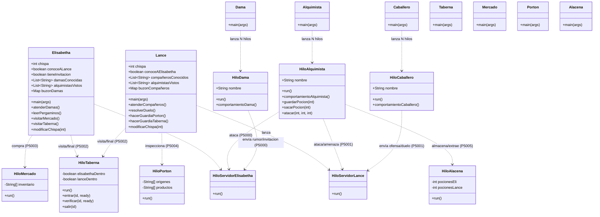

# Diagrama UML de Clases - La Chispa Adecuada

A continuación se muestra una representación simplificada de las clases del proyecto, sus atributos principales y sus métodos, omitiendo la herencia de `Thread` para mayor claridad.

### Resumen de la Estructura
- **Elisabetha y Lance** son los ejes centrales. Poseen un servidor interno para recibir influencias externas y un comportamiento de cliente para realizar sus acciones.
- **Los Alquimistas, Damas y Caballeros** son agentes externos (Clientes) que buscan afectar la "Chispa" de los protagonistas.
- **Los Servicios (Alacena, Mercado, Taberna, Portón)** son servidores pasivos que gestionan recursos o encuentros.
